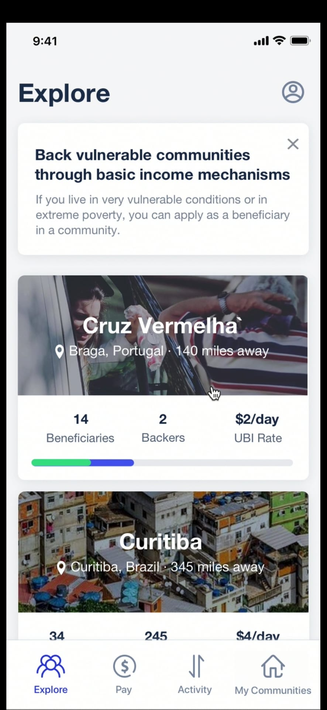

<div align="center">
    
</div>

> A decentralized impact-driven 2-sided marketplace to provide financial services to charities and vulnerable beneficiaries in need or living in extreme poverty.

## Installation

Use the package manager [yarn](https://yarnpkg.com/) to install dependencies.

```bash
yarn
```

## Usage

Install [expo](https://expo.io/) on your smarthpone, start the app with `yarn start` and acanr the QR.

## License
[Apache-2.0](LICENSE)