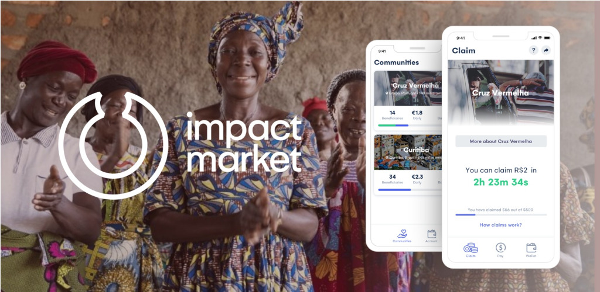

<div align="center">
    <br/><br/>
    <a href="https://expo.io/@impactmarket/"></a>
    <a href="https://github.com/impactMarket/mobile-app/workflows"></a>
</div>

> A decentralized impact-driven 2-sided marketplace to provide financial services to charities and vulnerable beneficiaries in need or living in extreme poverty.

Welcome to the public mobile app fraction of the impactMarket codebase.

## Installation

Use the package manager [yarn](https://yarnpkg.com/) to install dependencies.

```bash
yarn
```

## Usage

Install [expo](https://expo.io/) on your smartphone, start the app with `yarn start` and scan the QR.

If you have an android, you can try our demo [here](https://expo.io/@impactmarket/).

## Step by step...

- [x] Design mobile app
- [x] Integrate mobile app with base smart contract in testnet
- [x] Update mobile app, use new smart contracts
- [x] Explore and create new communities
- [x] Community manager page manager
- [x] Admin webui (to use until end of phase 2)
- [x] Transaction history and pay option
- [x] Create UI according to design planing
- [x] Multi-language
- [ ] Internal Play Store Testing (WIP)
- [ ] First Pilot
- [ ] ...

## License
[Apache-2.0](LICENSE)
